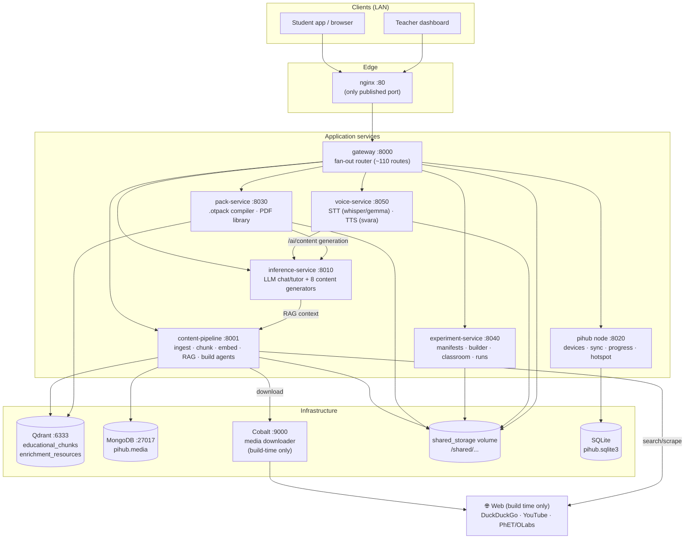
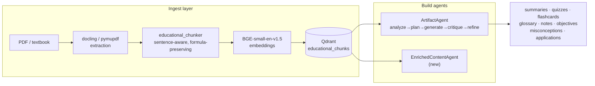
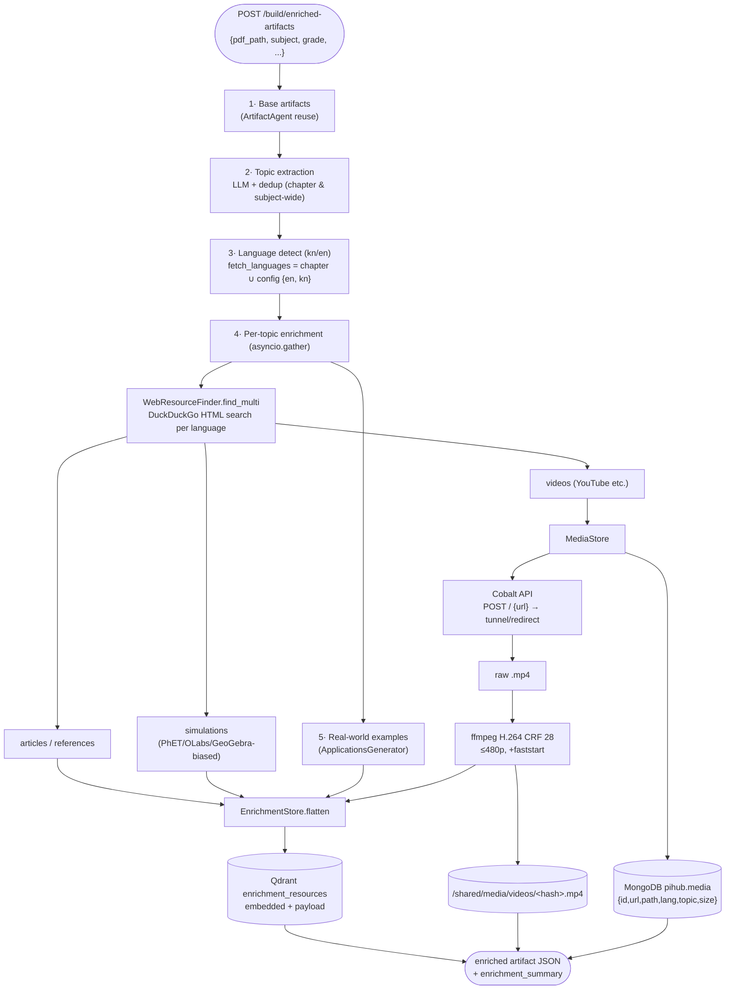
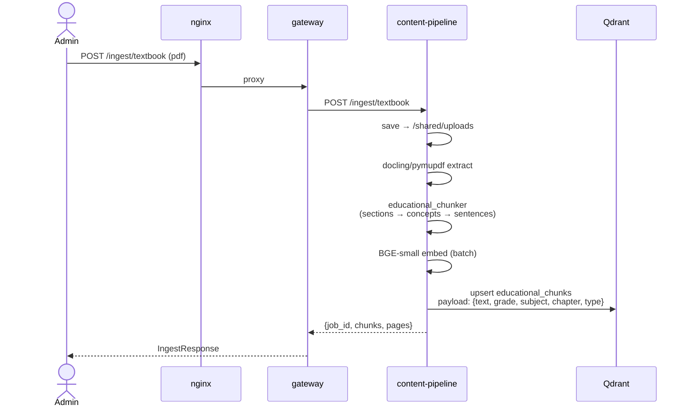
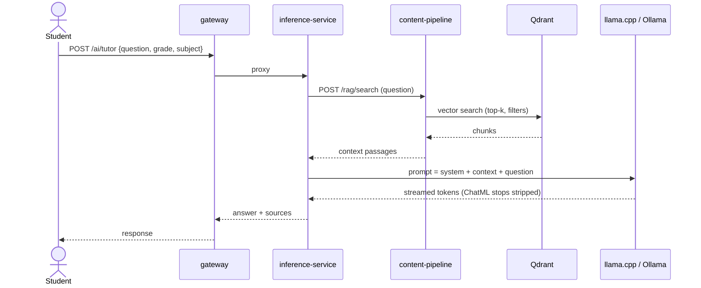
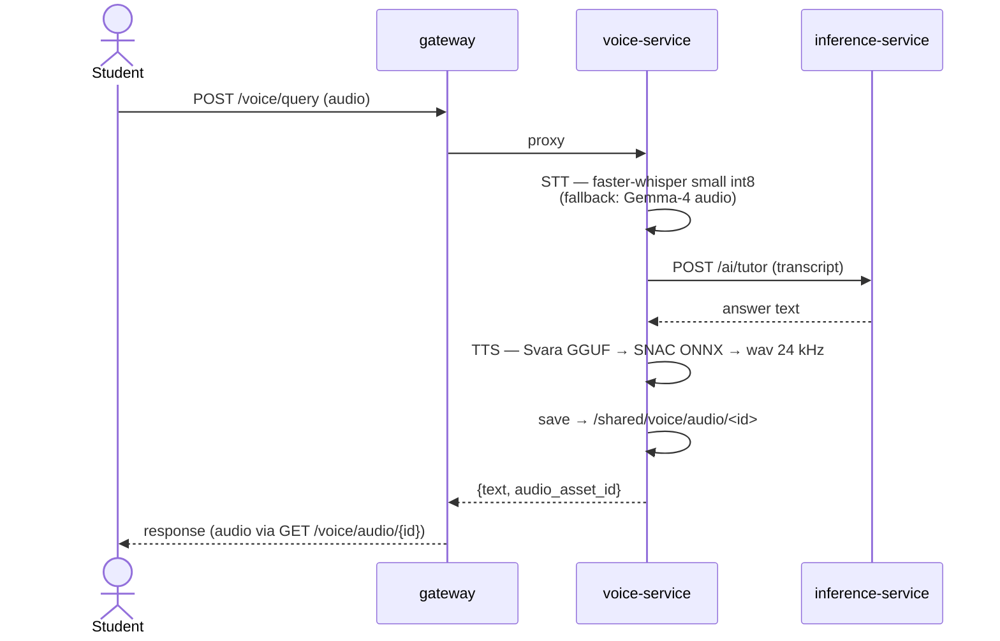
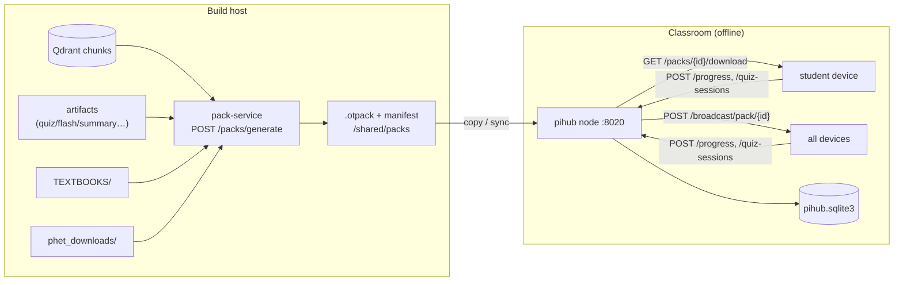
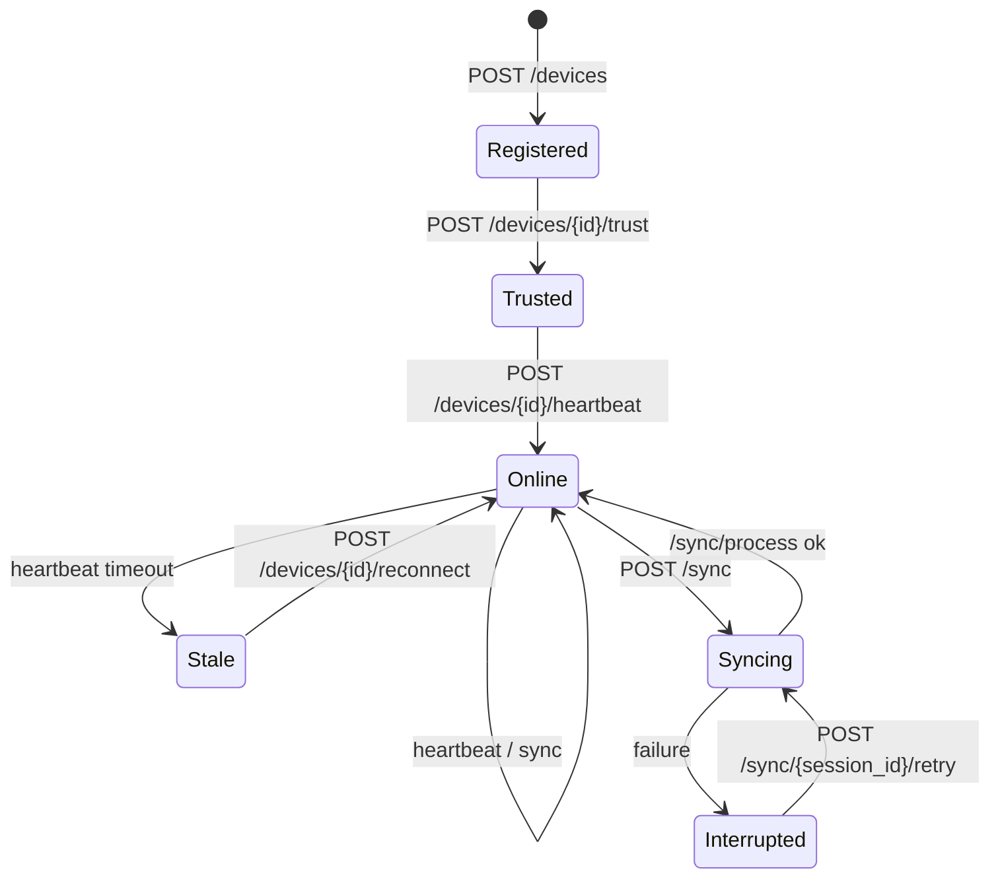
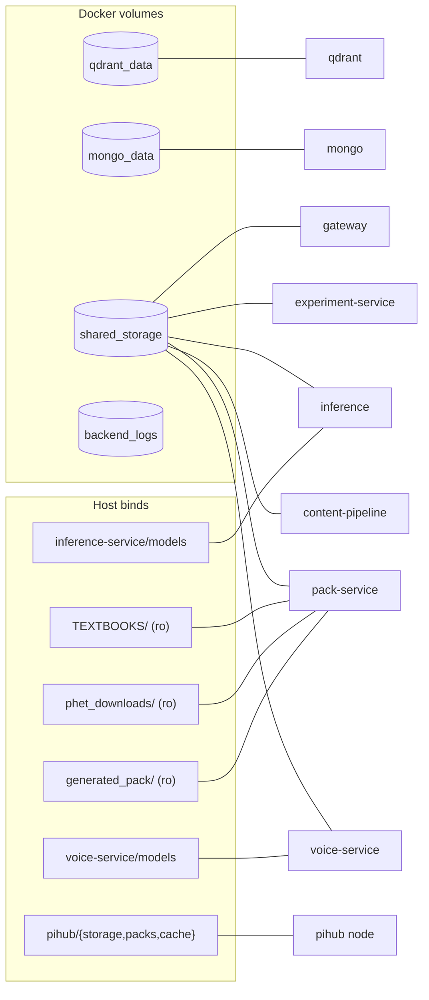
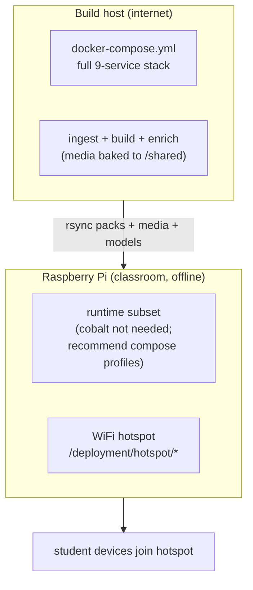

# PIHUB Backend — Complete System Documentation

> Offline-first educational content appliance: textbook PDFs in → enriched, bilingual
> (English + Kannada) learning packs out → served to classrooms from a Raspberry-Pi-class
> node with **zero internet at runtime**.
>
> Version: July 2026 · Branch `dev` · Companion docs: `SYSTEM-AUDIT-2026-07.md`,
> `REPO-HEALTH-2026-07.md`

---

## Table of contents

1. [High-level architecture](#1-high-level-architecture)
2. [Service catalog](#2-service-catalog)
3. [Folder structure](#3-folder-structure)
4. [Data flows (Mermaid)](#4-data-flows)
5. [Endpoint reference](#5-endpoint-reference)
6. [Data storage map](#6-data-storage-map)
7. [Configuration & environment](#7-configuration--environment)
8. [Deployment](#8-deployment)
9. [Access cheatsheet](#9-access-cheatsheet)

---

## 1. High-level architecture

Two lifecycle phases share one codebase:

- **Build time** (internet-connected host): ingest PDFs, chunk + embed, generate
  artifacts with LLMs, enrich with web media (videos/images/sims), compile packs.
- **Run time** (offline Pi in classroom): serve packs, RAG tutoring, voice Q&A,
  experiments, progress tracking — all from pre-baked local data.



**Communication:** plain HTTP/JSON over the Docker bridge network, DNS by compose
service name. No message queue; no gRPC in use. No inter-service auth (trusted
network); client auth only on the pihub node (admin + device tokens).

---

## 2. Service catalog

| Service | Port | Framework | Role | Key dependencies |
|---|---|---|---|---|
| **nginx** | 80 (host) | nginx 1.27-alpine | reverse proxy, single entry | gateway |
| **gateway** | 8000 | FastAPI | routes every client call to the right service | all services |
| **content-pipeline** | 8001 | FastAPI | PDF ingest → chunks → embeddings → Qdrant; RAG search; artifact/pack build agents; **EnrichedContentAgent** | qdrant, mongo, cobalt, web |
| **inference-service** | 8010 | FastAPI | LLM serving (llama.cpp GGUF or Ollama/gemma4), tutor with RAG, 8 content generators | content-pipeline |
| **pihub node** | 8020 | FastAPI | classroom runtime: device registry, pack distribution, sync, progress, quiz sessions, hotspot mgmt | SQLite |
| **pack-service** | 8030 | FastAPI | compiles chunks+artifacts+PDFs+PhET into `.otpack`; PDF library API | qdrant, inference |
| **experiment-service** | 8040 | FastAPI | experiment manifests (validate/migrate/sign/share), builder, classroom sessions, run analytics, AI experiment generation | shared fs |
| **voice-service** | 8050 | FastAPI | STT: faster-whisper small int8 (Gemma-4 audio fallback); TTS: Svara GGUF + SNAC ONNX 24 kHz | inference |
| **qdrant** | 6333/6334 | Qdrant v1.13.4 | vector DB (dense embeddings BGE-small) | — |
| **mongo** | 27017 | MongoDB 7.0 | enrichment media metadata | — |
| **cobalt** | 9000 | imputnet/cobalt | self-hosted media download API (replaces yt-dlp) | web |

### 2.1 content-pipeline internals (the build brain)



Package layout: `app/content_pipeline/` (chunking: `educational_chunker`,
`section_parser`, `formula_preserver`, `concept_boundary_detector`,
`paragraph_merger`, `extraction_cleaner`, `educational_classifier`,
`chunk_metadata_builder`), `app/curriculum_graph/`, `app/retrieval_engine/`,
`app/educational_intelligence/` (all generators + agents, see §3).

### 2.2 EnrichedContentAgent (bilingual enrichment)



Design guarantees: content-addressed media (blake2b of URL → idempotent re-runs),
every external dependency degrades gracefully (no Cobalt/ffmpeg/Mongo/web → warn &
continue), per-resource `language` tags, URL dedup across languages.

---

## 3. Folder structure

```
PIHUB/
├── backend/
│   ├── docker-compose.yml            # dev/build stack (9 services)
│   ├── docker-compose.server.yml     # server variant (⚠ publishes internal ports)
│   ├── .env                          # secrets & overrides (gitignored)
│   │
│   ├── shared/                       # cross-service python lib
│   │   ├── config.py                 #   pydantic-settings (all env vars)
│   │   ├── vector_store.py           #   Qdrant client wrapper (ensure/upsert/search)
│   │   ├── schemas.py, pack_schemas.py
│   │   ├── curriculum_graph.py
│   │   └── text_normalization.py, topic_normalization.py
│   │
│   ├── gateway/app/                  # main.py (~110 routes) + services/ (proxy clients)
│   │
│   ├── content-pipeline/
│   │   ├── app/
│   │   │   ├── main.py               # 25 endpoints (ingest/rag/debug/build)
│   │   │   ├── content_pipeline/     # chunking subsystem (9 modules)
│   │   │   ├── curriculum_graph/
│   │   │   ├── retrieval_engine/
│   │   │   ├── textbook_ingest.py, generated_pack_ingestor.py
│   │   │   └── educational_intelligence/
│   │   │       ├── agentic_orchestrator.py     # ArtifactAgent + ContentAnalyzer
│   │   │       ├── enriched_content_agent.py   # ★ new agent
│   │   │       ├── web_resource_finder.py      # ★ kn+en web search
│   │   │       ├── media_store.py              # ★ Cobalt+ffmpeg+Mongo
│   │   │       ├── enrichment_store.py         # ★ Qdrant persistence
│   │   │       ├── inference_client.py         # HTTP client → inference-service
│   │   │       ├── {summary,quiz,flashcard,glossary,chapter_notes,
│   │   │       │    learning_objectives,misconceptions,applications}_generator.py
│   │   │       ├── multilingual_support.py, formula_converter.py
│   │   │       ├── image_extractor.py, pack_compiler.py
│   │   │       ├── quality_evaluator.py, artifact_cleaning.py
│   │   │       ├── enrichment_router.py        # offline PhET catalog matcher
│   │   │       └── reports/                    # HTML pipeline reports
│   │   └── tests/                    # incl. test_enriched_content_agent.py (8)
│   │
│   ├── inference-service/app/        # main.py + tutor/ context/ language/
│   │                                 # orchestration/ sessions/ evaluation/ monitoring/
│   ├── pack-service/app/             # main.py + pack_system/ pack_storage/ importers/
│   │                                 # pdf_reader/ content_generation/ educational/
│   │                                 # sync/ validation/ analytics/ api/ evaluation/
│   ├── experiment-service/app/       # main.py + manifest/ builder/ sharing/ classroom/
│   │                                 # ai/ experiment_content/ storage/ services/ core/
│   ├── voice-service/                # app.py + models/ (gitignored: svara, snac, gemma4)
│   │
│   ├── pihub/                        # classroom node
│   │   ├── api/main.py               # ~50 endpoints (devices/sync/packs/progress/…)
│   │   ├── devices/ sync/ distribution/ deployment/ network/ monitoring/ cache/
│   │   ├── storage/pihub.sqlite3     # node DB (host-mounted)
│   │   └── packs/                    # local pack storage
│   │
│   ├── nginx/nginx.conf
│   ├── curriculum-builder/           # offline build scripts + reports
│   ├── certification/ content_forensics/ content_quality/   # QA tooling
│   └── docs/api/
│
├── phet_downloads/                   # ~100 offline PhET sims (index.html each)
├── generated_pack/                   # externally generated pack input (ro mount)
├── TEXTBOOKS/                        # PDF library (gitignored, ro mount)
├── docs/                             # audits + this file
└── .gitignore                        # models, scratch, TEXTBOOKS, reports…
```

---

## 4. Data flows

### 4.1 Textbook ingestion



### 4.2 RAG tutoring (runtime, offline)



### 4.3 Voice query round-trip



### 4.4 Pack build & distribution



### 4.5 Device lifecycle (classroom node)



---

## 5. Endpoint reference

### 5.1 gateway :8000 (public surface via nginx :80)

| Group | Endpoints |
|---|---|
| Health/discovery | `GET /health` · `/discovery` · `/discovery/beacon` · `/tutor/capabilities` |
| Ingest | `POST /upload` · `/content/upload` · `/ingest/pdf` · `/ingest/textbook` · `/ingest/generated-pack` · `/ingest/directory` · `/admin/reset-rag` |
| RAG | `POST /rag/search` · `/rag/curriculum_search` · `GET /rag/chapter` · `/rag/subject` |
| AI | `POST /ai/chat` · `/ai/tutor` · `/ai/tutor/debug` · `/ai/tutor/evaluate` · `GET /ai/health` |
| Voice | `POST /voice/query` · `/voice/tts` · `/voice/stt` · `GET /voice/audio/{asset_id}` · `/voice/metrics` (all also under `/api/voice/*`) |
| Packs | `GET /packs` · `/packs/sync` · `/packs/catalog` · `/packs/coverage` · `/packs/multilingual/plan` · `/packs/recommended` · `POST /packs/generate` · `GET /packs/{id}/manifest` · `/packs/{id}/download` |
| PDF library | `GET /api/v1/pdf/catalog` · `/resolve` · `/book/{grade}/{subject}` · `/chapter/{id}/metadata` · `/chapter/{id}` · `/file/{book_id}` |
| Experiments | `GET /experiments` · `/experiments/catalog` · `/experiments/search` · `/experiments/{id}` · `/{id}/download` · `/{id}/certification` · `/chapters/{id}/experiments` · `GET /simulations/{path}` · `/experiment-templates` |
| Experiment runs | `POST /experiment-runs` · `GET /experiment-runs/student/{id}` · `/{run_id}` · `POST /{run_id}/events` · `/{run_id}/complete` · `GET /experiment-metrics` |
| Classroom | `POST/GET /classroom/sessions` · assignments · submit · submissions · `GET /classroom/analytics` · `GET/POST /classroom` |
| Learning artifacts | `GET /flashcards` · `/quizzes` · `/glossary` · `/summaries` · `POST /planner/lesson` |
| Progress | `POST /progress` · `GET /progress/{student_id}` · `POST /quiz-sessions` · `GET .../student/{id}` · `.../{id}` · `POST .../{id}/answer` |
| Sync/devices | `GET/POST /sync` · `GET/POST /devices` |
| Analytics | `GET /analytics/student/{id}` · `/experiment/{id}` · `/system` · `/top-experiments` · `/metrics/tutor` · `/metrics/retrieval` |
| Demo/debug | `GET /demo` · `/demo/topics` · `POST /demo/tutor` · `GET /debug/curriculum` · `/curriculum-relations` · `/metadata` · `/chunks` · `POST /debug/retrieval` · `GET /debug/similarity` · `/pack-preview` · `/learning-pack-preview` |

### 5.2 content-pipeline :8001 (internal)

`GET /health` · `POST /ingest/pdf|textbook|generated-pack|directory` ·
`POST /admin/reset-rag` · `POST /rag/search|curriculum_search` · `GET /rag/chapter|subject` ·
`GET /debug/curriculum|curriculum-relations|metadata|chunks|similarity|pack-preview|learning-pack-preview` ·
`POST /debug/retrieval` · `POST /build/artifacts` · `POST /build/pack` ·
`GET /build/quality/{path}` · `POST /build/agentic-artifacts` ·
**`POST /build/enriched-artifacts`** · `GET /build/report/{job_id}` · `GET /reports`

<details><summary>POST /build/enriched-artifacts — request body</summary>

```json
{
  "pdf_path": "/shared/uploads/science8_ch11.pdf",
  "subject": "science", "grade": 8, "chapter": "Force and Pressure",
  "max_topics": 8,
  "include_web": true,
  "dedupe_across_subject": true,
  "download_media": true,
  "persist": true,
  "fetch_languages": ["en", "kn"]
}
```
Response: artifact JSON path + topics + per-topic enrichment (videos/articles/sims/
real-world, each with `language`, `local_path` when downloaded) + `enrichment_summary`.
</details>

### 5.3 inference-service :8010 (internal)

`GET /ai/health` · `POST /ai/chat` · `/ai/tutor` · `/ai/tutor/debug` · `/ai/tutor/evaluate` ·
`GET /metrics/tutor|retrieval` ·
`POST /ai/content/summary|chapter-notes|flashcards|quiz|glossary|learning-objectives|misconceptions|applications`

### 5.4 pihub node :8020 (classroom)

`GET /health` · `/health/resources` · `/health/diagnostics` ·
devices: `GET/POST /devices` · `POST /devices/{id}/heartbeat|reconnect|trust` · `GET /devices/{id}/status` ·
packs: `GET/POST /packs` · `GET /packs/{id}` · `/packs/{id}/download` · `/packs/{id}/distribution` · `POST /broadcast/pack/{id}` ·
sync: `GET/POST /sync` · `POST /sync/process` · `/sync/{session_id}/retry` · `GET /sessions` · `/sessions/{id}` ·
progress: `POST /progress` · `GET /progress/{student_id}` · quiz-sessions CRUD + `/answer` ·
network: `GET /network/status|devices` · `POST /network/session` ·
backend link: `POST /backend/sync|sync-now` · `GET /backend/status|health` ·
deployment: `GET/POST /deployment/hotspot/*` · `GET /deployment/startup/validate|containers` · `POST .../containers/{name}/restart` · `GET /deployment/status` · `/deployment/sync/health|diagnostics|interrupted` ·
cache: `GET /cache/stats|health` · classroom: `GET/POST /classroom`

### 5.5 pack-service :8030 (internal)

`GET /health` · `POST /packs/generate` · `POST /packs/import/generated` · `POST /packs/import/phet`
(+ PDF library endpoints surfaced through gateway `/api/v1/pdf/*`)

### 5.6 experiment-service :8040 (internal)

manifest: `POST /manifest/validate|migrate|resolve|compatibility|capability-check|scene/validate|execution/validate` · `GET /manifest/versions` ·
builder: `POST /builder/manifests` · `PUT /builder/manifests/{id}` · `POST .../{id}/publish|archive` ·
sharing: `POST /sharing/sign|verify|trust|import|export` · `GET /sharing/analytics` ·
classroom: `POST /classroom/sessions` · `.../{id}/assignments` · `POST /classroom/assignments/{id}/submit` ·
execution: `POST /execution-package` · runs + events + complete ·
AI: `POST /ai/generate-experiment|refine-experiment|explain-experiment`

### 5.7 voice-service :8050 (internal)

`GET /health` · `POST /voice/stt` · `/voice/tts` · `/voice/query` ·
`GET /voice/audio/{asset_id}` · `/audio/{asset_id}` · `GET /voice/metrics`

---

## 6. Data storage map

| Data | Store | Exact location | How to inspect |
|---|---|---|---|
| Text chunks + embeddings | Qdrant `educational_chunks` | volume `qdrant_data` → `/qdrant/storage` | `curl qdrant:6333/collections/educational_chunks` |
| Enrichment records | Qdrant `enrichment_resources` | same volume | same |
| Media metadata | Mongo `pihub.media` | volume `mongo_data` → `/data/db` | `mongosh mongodb://mongo:27017/pihub` |
| Downloaded videos | filesystem | `/shared/media/videos/<blake2b-12>.mp4` | shared_storage volume |
| Downloaded images | filesystem | `/shared/media/images/<hash>.<ext>` | same |
| Uploaded PDFs | filesystem | `/shared/uploads` | same |
| Build workdir + curriculum graph | filesystem | `/shared/work`, `.../curriculum_graph.json` | same |
| Compiled packs | filesystem | `/shared/packs` (+ `pdf_manifests/pdf_manifest.json`) | same |
| Textbook PDFs | host bind ro | `TEXTBOOKS/` → `/shared/textbooks` | host |
| PhET sims | host bind ro | `phet_downloads/` → `/shared/phet_downloads` & `/shared/simulations` | host |
| Node DB | SQLite | host `backend/pihub/storage/pihub.sqlite3` | `sqlite3 ... '.tables'` |
| Node packs/cache/logs | host bind | `backend/pihub/{packs,storage,cache,logs}` | host |
| LLM GGUF models | host bind | `backend/inference-service/models/` → `/models` | host (gitignored) |
| Voice models | host bind | `backend/voice-service/models/` (svara GGUF, SNAC ONNX, gemma4 HF cache) | host (gitignored) |
| Embedding model cache | filesystem | `/shared/models/sentence-transformers/{embedding,retrieval}` | shared volume |
| Voice audio out | filesystem | `/shared/voice/audio` + `audio_manifest.json` | shared volume |
| Service logs | volume `backend_logs` | `/logs`, `/var/log/{nginx,qdrant,mongo}` | `docker logs <container>` |



---

## 7. Configuration & environment

All settings flow through `backend/shared/config.py` (pydantic-settings, env-alias
based) + per-service env in compose. Highlights:

| Var | Default | Used by |
|---|---|---|
| `QDRANT_URL` / `QDRANT_COLLECTION` | `http://qdrant:6333` / `educational_chunks` | content-pipeline, pack-service, gateway |
| `EMBEDDING_MODEL_NAME` | `BAAI/bge-small-en-v1.5` (cpu) | content-pipeline |
| `MONGO_URL` / `MONGO_DB` | `mongodb://mongo:27017` / `pihub` | content-pipeline (MediaStore) |
| `MEDIA_STORAGE_PATH` | `/shared/media` | MediaStore |
| `COBALT_API_URL` | `http://cobalt:9000` | MediaStore |
| `ENRICHMENT_LANGUAGES` | `en,kn` | EnrichedContentAgent |
| `ENRICHMENT_COLLECTION` | `enrichment_resources` | EnrichmentStore |
| `CONTENT_GENERATION_BACKEND` | `ollama` (`GEMMA_CONTENT_MODEL=gemma4`) | inference-service |
| `LLAMA_MODEL_PATH` | `/models/model.gguf` (ctx 2048) | inference-service |
| `WHISPER_MODEL` / `WHISPER_COMPUTE_TYPE` | `small` / `int8` | voice-service |
| `SVARA_MODEL_PATH` | `/models/svara/svara-tts-v1.Q4_K_M.gguf` | voice-service |
| `PIHUB_ADMIN_TOKEN` / `PIHUB_DEVICE_TOKEN_SECRET` | ⚠ `change-me` defaults | pihub node |
| `NGINX_PORT` | 80 | nginx |

Secrets live in `backend/.env` (gitignored).

---

## 8. Deployment



- **Dev/build:** `cd backend && docker compose up -d` — only nginx `:80` published.
- **Server:** `docker-compose.server.yml` — ⚠ additionally publishes 6333/6334, 8001,
  8010, 8050 to the host (flagged in `REPO-HEALTH-2026-07.md`; route through nginx instead).
- **Startup order:** `depends_on` without health conditions (voice-service is the only
  one with a healthcheck) — services tolerate races by retrying/degrading.
- Known operational gaps & the prioritized fix list live in
  `docs/REPO-HEALTH-2026-07.md` §6 and `docs/SYSTEM-AUDIT-2026-07.md` §6.

---

## 9. Access cheatsheet

```bash
# Front door
curl http://localhost/health                                  # gateway via nginx

# Qdrant (inside the compose network)
docker run --rm --network backend_default curlimages/curl -s \
  http://qdrant:6333/collections | jq
docker exec pihub-qdrant sh -c 'ls /qdrant/storage/collections'

# Mongo media metadata
docker exec -it pihub-mongo mongosh pihub --eval 'db.media.find().limit(3).pretty()'

# Node SQLite
sqlite3 backend/pihub/storage/pihub.sqlite3 '.tables'

# Shared storage (find host path, then browse)
docker volume inspect backend_shared_storage -f '{{.Mountpoint}}'
sudo ls "$(docker volume inspect backend_shared_storage -f '{{.Mountpoint}}')/media/videos"

# Enriched build (end-to-end)
curl -X POST http://localhost/ingest/textbook -F file=@science8.pdf
curl -X POST http://content-pipeline:8001/build/enriched-artifacts \
  -H 'content-type: application/json' \
  -d '{"pdf_path":"/shared/uploads/science8.pdf","subject":"science","grade":8}'

# Logs
docker logs -f pihub-content-pipeline
```

---

*Generated July 2026 from code inspection of branch `dev` (commit `55a3cff`).*
