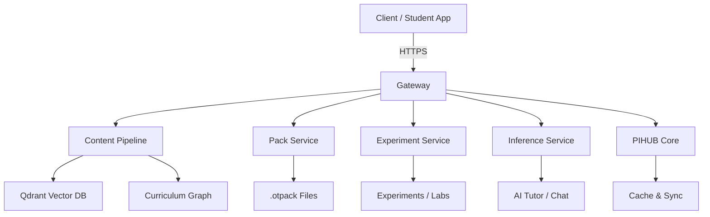
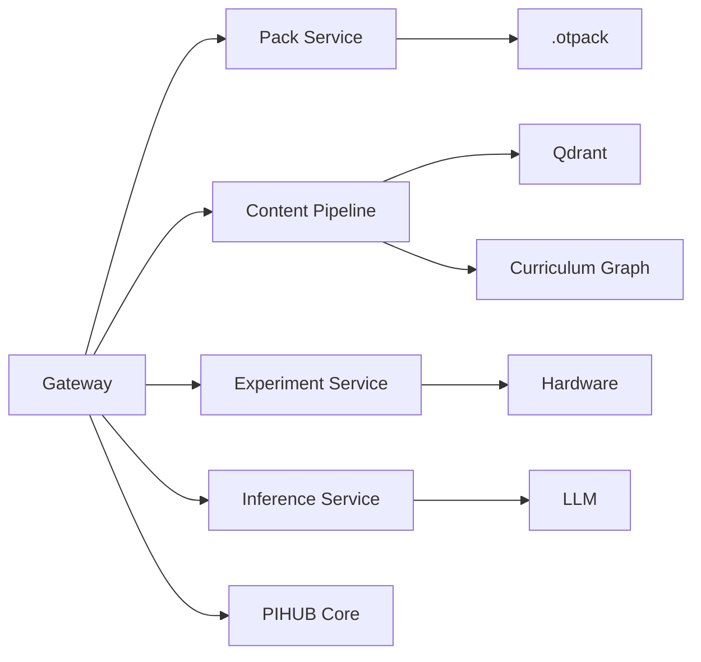

# Backend Inventory Report
*Generated: 2026-06-09*

---

## 1. Service Inventory

| # | Service | Path | Domain | Docker |
|---|---------|------|--------|--------|
| 1 | Gateway | `backend/gateway` | API Gateway | Yes |
| 2 | Content Pipeline | `backend/content-pipeline` | Content Ingestion + RAG | Yes |
| 3 | Pack Service | `backend/pack-service` | Pack Generation + Distribution | Yes |
| 4 | Experiment Service | `backend/experiment-service` | Experiment Engine | Yes |
| 5 | Inference Service | `backend/inference-service` | AI Tutor | Yes |
| 6 | PIHUB Core | `backend/pihub` | Device / Cache / Sync | Yes |
| 7 | Curriculum Builder | `backend/curriculum-builder` | Curriculum Compilation | No |
| 8 | Content Forensics | `backend/content_forensics` | Quality Audits | No |
| 9 | Content Quality | `backend/content_quality` | Evaluation Suite | No |

---

## 2. API Inventory

### 2.1 Pack Service APIs
| Route | Method | Endpoint |
|-------|--------|----------|
| PDF Catalog | GET | `/api/v1/pdf/catalog` |
| PDF Chapter | GET | `/api/v1/pdf/chapter/{chapter_id}` |
| PDF Metadata | GET | `/api/v1/pdf/chapter/{chapter_id}/metadata` |
| PDF Book | GET | `/api/v1/pdf/book/{grade}/{subject}` |
| PDF Resolve | GET | `/api/v1/pdf/resolve` |
| PDF File | GET | `/api/v1/pdf/file/{book_id}` |
| PDF Scan | POST | `/api/v1/pdf/scan` |
| Pack List | GET | `/api/v1/packs/list` |
| Pack Search | GET | `/api/v1/packs/search` |
| Pack Detail | GET | `/api/v1/packs/{pack_id}` |
| Pack Manifest | GET | `/api/v1/packs/{pack_id}/manifest` |
| Pack Preview | GET | `/api/v1/packs/{pack_id}/preview` |
| Pack Download | GET | `/api/v1/packs/{pack_id}/download` |
| Pack Validate | POST | `/api/v1/packs/{pack_id}/validate` |
| Sync Manifest | POST | `/api/v1/sync/manifest` |
| Sync Delta | POST | `/api/v1/sync/delta` |
| Pack Benchmark | GET | `/api/v1/packs/{pack_id}/benchmark` |
| Pack Evaluation | GET | `/api/v1/packs/{pack_id}/evaluation` |

### 2.2 Gateway APIs
| Route | Method | Endpoint |
|-------|--------|----------|
| Discovery | GET | `/discovery` |
| Discovery Beacon | GET | `/discovery/beacon` |
| Tutor Capabilities | GET | `/tutor/capabilities` |
| Health | GET | `/health` |
| Content Upload | POST | `/content/upload` |
| Upload (Legacy) | POST | `/upload` |
| Textbook Ingest | POST | `/ingest/textbook` |
| RAG Search | POST | `/rag/search` |
| RAG Chapter | GET | `/rag/chapter` |
| RAG Subject | GET | `/rag/subject` |
| AI Chat | POST | `/ai/chat` |
| AI Tutor | POST | `/ai/tutor` |
| AI Health | GET | `/ai/health` |
| Sync | GET/POST | `/sync` |
| Get Packs | GET | `/packs` |
| Packs Sync | GET | `/packs/sync` |
| Packs Catalog | GET | `/packs/catalog` |
| Packs Recommended | GET | `/packs/recommended` |
| Pack Generate | POST | `/packs/generate` |
| Pack Manifest | GET | `/packs/{pack_id}/manifest` |
| Pack Download | GET | `/packs/{pack_id}/download` |

### 2.3 Experiment Service APIs
| Route | Method | Endpoint |
|-------|--------|----------|
| List Experiments | GET | `/experiments` |
| Search Experiments | GET | `/experiments/search` |
| Subjects | GET | `/experiments/subjects` |
| Topics | GET | `/experiments/topics` |
| Get Experiment | GET | `/experiments/{experiment_id}` |
| Templates | GET | `/experiment-templates` |
| Run Experiment | POST | `/experiment-runs` |
| Get Run | GET | `/experiment-runs/{run_id}` |
| Submit Run Events | POST | `/experiment-runs/{run_id}/events` |
| Complete Run | POST | `/experiment-runs/{run_id}/complete` |
| Student Analytics | GET | `/analytics/student/{student_id}` |
| Experiment Analytics | GET | `/analytics/experiment/{experiment_id}` |
| System Analytics | GET | `/analytics/system` |
| Top Experiments | GET | `/analytics/top-experiments` |
| Builder Manifests | POST/GET | `/builder/manifests` |
| Classroom Sessions | GET/POST | `/classroom/sessions` |
| AI Generate | POST | `/ai/generate-experiment` |
| AI Refine | POST | `/ai/refine-experiment` |
| AI Explain | POST | `/ai/explain-experiment` |
| Manifest Templates | GET | `/manifest/templates` |
| Sharing Export | POST | `/sharing/export` |
| Sharing Import | POST | `/sharing/import` |
| Sharing Verify | POST | `/sharing/verify` |
| Maintenance DB Health | GET | `/maintenance/database-health` |
| Maintenance Hash Audit | GET | `/maintenance/hash-audit` |

### 2.4 PIHUB Core APIs
| Route | Method | Endpoint |
|-------|--------|----------|
| Health | GET | `/health` |
| Classroom | GET/POST | `/classroom` |
| Devices | GET/POST | `/devices` |
| Device Heartbeat | POST | `/devices/{device_id}/heartbeat` |
| Device Reconnect | POST | `/devices/{device_id}/reconnect` |
| Packs | GET/POST | `/packs` |
| Pack Detail | GET | `/packs/{pack_id}` |
| Pack Download | GET | `/packs/{pack_id}/download` |
| Sync | GET/POST | `/sync` |
| Progress | GET/POST | `/progress` |
| Quiz Sessions | GET/POST | `/quiz-sessions` |
| Network Status | GET | `/network/status` |
| Deployment Hotspot | GET | `/deployment/hotspot/health` |
| Deployment Status | GET | `/deployment/status` |
| Cache Stats | GET | `/cache/stats` |

---

## 3. Repository Inventory

| # | Repository | Path | Module Count | Key Purpose |
|---|-----------|------|-------------|-------------|
| 1 | content_pipeline | `backend/content-pipeline/app/content_pipeline` | 8 | Textbook chunking, cleaning, metadata |
| 2 | curriculum_graph | `backend/content-pipeline/app/curriculum_graph` | 7 | Concept graphs, prerequisite links |
| 3 | educational_intelligence | `backend/content-pipeline/app/educational_intelligence` | 7 | Flashcards, quizzes, summaries, glossaries |
| 4 | retrieval_engine | `backend/content-pipeline/app/retrieval_engine` | 1 | Educational search & retrieval |
| 5 | experiment_service | `backend/experiment-service` | 12+ | Experiments, labs, simulations |
| 6 | pack_service | `backend/pack-service` | 8+ | .otpack generation, validation |
| 7 | gateway | `backend/gateway` | 1 | Reverse proxy, aggregation |
| 8 | inference_service | `backend/inference-service` | 1 | AI chat/tutor endpoints |
| 9 | pihub_core | `backend/pihub` | 7+ | Cache, sync, deployment |
| 10 | shared | `backend/shared` | 5 | Common schemas, config, vector store |
| 11 | scripts | `backend/scripts` | 20+ | Audit, repair, regeneration utilities |
| 12 | content_forensics | `backend/content_forensics` | 15+ | Forensic quality checks |
| 13 | content_quality | `backend/content_quality` | 6 | Quality evaluation tools |
| 14 | curriculum_builder | `backend/curriculum-builder` | 8 | Curriculum compilation pipeline |

---

## 4. Educational Intelligence Inventory

| # | Component | Path | Function |
|---|-----------|------|----------|
| 1 | Educational Chunker | `content_pipeline/educational_chunker.py` | Chunk text with educational boundaries |
| 2 | classifier | `content_pipeline/educational_classifier.py` | Classify chunk pedagogical types |
| 3 | enrichment_router | `educational_intelligence/enrichment_router.py` | Route enrichment to generators |
| 4 | flashcard_generator | `educational_intelligence/flashcard_generator.py` | Generate flashcards from chunks |
| 5 | quiz_generator | `educational_intelligence/quiz_generator.py` | Generate MCQs, fill-blanks |
| 6 | summary_generator | `educational_intelligence/summary_generator.py` | Generate topic summaries |
| 7 | glossary_extractor | `educational_intelligence/glossary_extractor.py` | Extract definitions |
| 8 | multilingual_support | `educational_intelligence/multilingual_support.py` | Kannada/English translation |
| 9 | quality_evaluator | `educational_intelligence/quality_evaluator.py` | Score enrichment quality |
| 10 | pack_compiler | `educational_intelligence/pack_compiler.py` | Assemble into .otpack |
| 11 | curriculum_router | `curriculum_graph/curriculum_router.py` | Navigate curriculum graph |
| 12 | concept_index | `curriculum_graph/concept_index.py` | Index concepts by grade/subject |
| 13 | concept_linker | `curriculum_graph/concept_linker.py` | Link concepts across grades |
| 14 | prerequisite_mapper | `curriculum_graph/prerequisite_mapper.py` | Map prerequisite chains |
| 15 | graph_builder | `curriculum_graph/graph_builder.py` | Build concept graph |
| 16 | graph_storage | `curriculum_graph/graph_storage.py` | Persist graph to disk |

---

## 5. Data Flow Inventory

### 5.1 Content Ingestion Flow
```
PDF/Textbooks → content_pipeline
                ↓
            chunking_smoke.py (chunking)
                ↓
            section_parser.py (parse sections)
                ↓
            educational_chunker.py (chunk by pedagogy)
                ↓
            extraction_cleaner.py (clean)
                ↓
            chunk_metadata_builder.py (metadata)
                ↓
            qdrant (vector_store)
                ↓
            curriculum_graph (graph relations)
                ↓
            educational_intelligence (enrichment)
                ↓
            .otpack (pack_compiler)
```

### 5.2 Experiment Engine Flow
```
Teacher/Student → Gateway (/experiments)
                ↓
            experiment-service
                ↓
            broker/AITutorPlugin → Hardware Interaction
                ↓
            experiment_manifest.json (validated JSON)
                ↓
            Experiment App (HTML5/WebRTC)
                ↓
            Real-time sensor data → AITutor
```

### 5.3 Pack Distribution Flow
```
Gateway (/packs/...)
    ↓
Pack Service (manifest.yml validation)
    ↓
pdf_reader (chapter mapping)
    ↓
textbook_builder (structural assembly)
    ↓
pack_compiler (enrichment + bundle)
    ↓
.otpack file
    ↓
Gateway → cache → Device
```

### 5.4 RAG Retrieval Flow
```
Student Question → Gateway (/rag/search)
                ↓
            inference-service (AI Tutor)
                ↓
            retrieval_engine
                ↓
            qdrant (vector search)
                ↓
            curriculum_graph (context expansion)
                ↓
            GPT/LLM response generation
```

---

## 6. Database Inventory

### 6.1 Persistent Databases
| # | Engine | File/Host | Purpose |
|---|--------|-----------|---------|
| 1 | SQLite | `experiment-service/app/storage/classroom.sqlite3` | Classroom sessions |
| 2 | SQLite | `experiment-service/app/storage/sharing.sqlite3` | Experiment sharing |
| 3 | SQLite | `experiment-service/app/storage/builder_manifests.sqlite3` | Builder manifests |
| 4 | SQLite | `experiment-service/storage/experiment_service.sqlite3` | Core experiment data |
| 5 | SQLite | `experiment-service/storage/seed_experiments.json` | Seed data |

### 6.2 Vector Database
| # | Engine | Collection | Purpose |
|---|--------|------------|---------|
| 1 | Qdrant | `textbook_chunks` | Semantic chunk search |
| 2 | Qdrant | `curriculum_nodes` | Curriculum graph search |
| 3 | Qdrant | `educational_resources` | Resource matching |

### 6.3 Key Schemas
- `experiment-service/app/storage/schema.sql`: Core SQLite schema
- `experiment-service/app/storage/sqlite_schema.py`: Schema Python model

---

## 7. Qdrant Architecture

| # | Component | Integration Point |
|---|-----------|-------------------|
| 1 | QdrantClient | `shared/vector_store.py` |
| 2 | Collection: `textbook_chunks` | `content_pipeline/retrieval_engine` |
| 3 | Collection: `curriculum_nodes` | `curriculum_graph/graph_storage.py` |
| 4 | Collection: `educational_resources` | `pack-service/evaluation/retrieval_validator.py` |

---

## 8. Experiment Engine Architecture

| # | Component | Path | Role |
|---|-----------|------|------|
| 1 | experiment-service | `backend/experiment-service/` | Main service container |
| 2 | runtime | `backend/experiment-service/runtime/` | Execute experiment runs |
| 3 | builder | `backend/experiment-service/app/builder/` | Build manifest from JSON |
| 4 | classroom | `backend/experiment-service/app/classroom/` | Multi-student sessions |
| 5 | ai | `backend/experiment-service/app/ai/` | AI-generated experiments |
| 6 | manifest | `backend/experiment-service/app/manifest/` | Versioned manifest storage |
| 7 | sharing | `backend/experiment-service/app/sharing/` | Export/import/sharing |
| 8 | analytics | `backend/experiment-service/analytics/` | Usage analytics |
| 9 | core | `backend/experiment-service/app/core/` | DB, errors, pagination |

---

## 9. Pack Distribution Architecture

| # | Layer | Components |
|---|-------|------------|
| 1 | Gateway | `gateway/app/main.py` |
| 2 | Pack Service | `pack-service/app/api/pack_routes.py` |
| 3 | Manifest Builder | `pack-service/app/pack_system/manifest_builder.py` |
| 4 | Manifest Validator | `pack-service/app/pack_system/manifest_validator.py` |
| 5 | PDF Reader | `pack-service/app/pdf_reader/` (chapter_page_mapper, pdf_repository) |
| 6 | Textbook Builder | `pack-service/app/educational/textbook_builder.py` |
| 7 | Content Pipeline | `content-pipeline/` (chunking, enrichment) |
| 8 | Curriculum Graph | `curriculum_graph/` (prerequisite mapping) |
| 9 | Sync Engine | `pack-service/app/sync/` (delta_builder, sync_manifest_generator) |
| 10 | Validation | `pack-service/app/validation/` (pack_validator, quiz_validator, retrieval_validator) |

---

## 10. Mermaid Diagrams

### 10.1 Overall Backend Architecture


### 10.2 Service Dependency Graph


### 10.3 Data Flow – Content Ingestion


---

## 11. Dead Code Candidates

| # | Path | Likely Dead? | Reason |
|---|------|-------------|--------|
| 1 | `backend/.venv/` paths | Yes | Virtual environment, not runtime |
| 2 | `backend/pihub/cache/debug_routes.py` | Maybe | Debug routes in prod? |
| 3 | `backend/pack-service/app/api/preview_routes.py` | Maybe | Only internal debug |
| 4 | `backend/scripts/*_audit.py` | Partial | Forensic scripts run once |
| 5 | `backend/content_forensics/*.py` | Partial | One-off audit scripts |
| 6 | Duplicate `__pycache__` | Yes | Build artifacts |
| 7 | `backend/curriculum-builder/build_cache.json` | Maybe | Could be stale cache |
| 8 | `backend/pack-service/app/api/pack_response_models.py` | Verify | Check if used by routes |
| 9 | `backend/shared/topic_normalization.py` | Verify | Check imports |
| 10 | `backend/debug_script.py` | Yes | Debug script |

---

## 12. Architecture Risks

| # | Risk | Severity | Mitigation |
|---|------|----------|------------|
| 1 | Single Qdrant instance (no cluster) | High | Add replication, cluster |
| 2 | SQLite for experiment service (scale) | Medium | Migrate to Postgres |
| 3 | No explicit auth middleware in Gateway | High | Add OAuth2/JWT |
| 4 | Multiple SQLite files (no transactions across) | Medium | Global transaction manager |
| 5 | Hardcoded paths in scripts | Medium | Use config.py / env vars |
| 6 | Large .otpack build in repo (TEMP/) | Medium | Move to S3 / object storage |
| 7 | No rate limiting on AI endpoints | High | Add rate limiter |
| 8 | Content pipeline directly writes to Qdrant | Medium | Abstract via service layer |
| 9 | No health check for Qdrant | Medium | Add /health/qdrant |
| 10 | Curriculum graph in-memory | Medium | Persist to disk / Redis |

---

## 13. Dependency Graph

### 13.1 Core Services → Shared Libraries
```
gateway            → shared (schemas, config)
pack-service       → shared (schemas, config, vector_store)
experiment-service → shared (schemas, config)
content-pipeline   → shared (schemas, config, vector_store)
inference-service  → shared (schemas, config)
pihub              → shared (schemas, config)
```

### 13.2 Service-Level Dependencies
```
Gateway → Pack Service
       → Experiment Service
       → Inference Service
       → Content Pipeline
       → PIHUB Core

Pack Service → Content Pipeline (indirect)
            → Qdrant

Content Pipeline → Qdrant
                → Curriculum Graph
                → Educational Intelligence

Experiment Service → SQLite DBs
                  → AI Service (indirect)
```

---

## 14. Backend Feature Matrix

| # | Feature | Gateway | Pack | Pipeline | Experiment | Inference | PIHUB |
|---|---------|---------|------|----------|-----------|-----------|-------|
| 1 | PDF Ingestion | R | - | W | - | - | - |
| 2 | Chunking | - | - | W | - | - | - |
| 3 | Vector Search | R | - | W | - | R | - |
| 4 | Curriculum Graph | - | R | W | - | R | - |
| 5 | Pack Generation | W | W | - | - | - | - |
| 6 | Pack Download | W | R | - | - | - | - |
| 7 | Pack Sync | W | W | - | - | - | - |
| 8 | Experiment Catalog | R | - | - | W | - | - |
| 9 | Experiment Run | - | - | - | W | - | - |
| 10 | Classroom | - | - | - | W | - | - |
| 11 | AI Chat | - | - | - | - | W | - |
| 12 | AI Tutor | R | - | - | - | W | - |
| 13 | Device Discovery | - | - | - | - | - | W |
| 14 | Hotspot | - | - | - | - | - | W |
| 15 | Cache | - | - | - | - | - | W |
| 16 | Sync | R | - | - | - | - | W |

W = Write / Own, R = Read / Use

---

## 15. Backend Component Map

### 15.1 Directory Structure
```
backend/
├── content-pipeline/       # ingestion + rag
├── content_pipeline/       # legacy (check usage)
├── content_quality/        # evaluators
├── content_forensics/      # audit scripts
├── curriculum-builder/     # curriculum compilation
├── experiment-service/     # experiment engine
├── gateway/                # api gateway
├── inference-service/      # ai tutor
├── nginx/                  # reverse proxy
├── pack-service/           # pack generation
├── pihub/                  # core runtime
├── scripts/                # utilities
└── shared/                 # common code
```

### 15.2 Service Communication
| Source | Target | Protocol | Purpose |
|--------|--------|----------|---------|
| Gateway | Pack Service | HTTP | Proxy pack routes |
| Gateway | Experiment Service | HTTP | Proxy experiment routes |
| Gateway | Inference Service | HTTP | Proxy AI routes |
| Gateway | Content Pipeline | HTTP | Proxy ingestion |
| Content Pipeline | Qdrant | gRPC/HTTP | Vector search |
| Pack Service | Qdrant | gRPC/HTTP | Retrieval validation |
| Experiment Service | SQLite | SQL | Data persistence |
| Inference Service | LLM | HTTP | AI generation |

---

*End of Backend Inventory Report*
